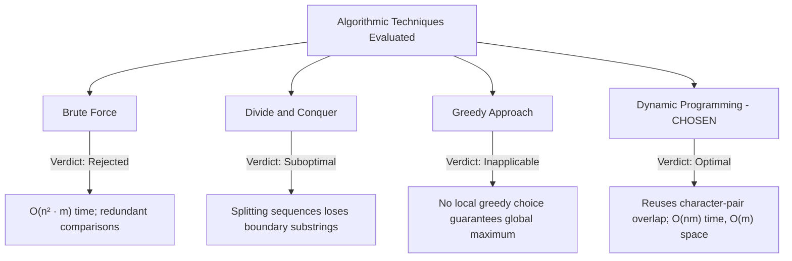

# Comprehensive Project Documentation
## Longest Common DNA Substring (Bioinformatics Analysis System)
**DAA Hackathon Project | Academic & Technical Report**

---

## Table of Contents
1. [Executive Summary](#1-executive-summary)
2. [Problem Definition & Biological Context](#2-problem-definition--biological-context)
3. [Algorithm Design & Technique Selection](#3-algorithm-design--technique-selection)
4. [Mathematical Formulation & DP Recurrence](#4-mathematical-formulation--dp-recurrence)
5. [Complexity Analysis & Space Optimization](#5-complexity-analysis--space-optimization)
6. [Detailed Walkthrough of Worked Example](#6-detailed-walkthrough-of-worked-example)
7. [System Architecture & Source Components](#7-system-architecture--source-components)
8. [Biological Datasets & FASTA Pipeline](#8-biological-datasets--fasta-pipeline)
9. [Test Suite, Edge Cases & Verification](#9-test-suite-edge-cases--verification)
10. [Empirical Benchmarks & Performance](#10-empirical-benchmarks--performance)
11. [User Interface & Visualization Architecture](#11-user-interface--visualization-architecture)
12. [Viva Voce & Jury Defense Guide](#12-viva-voce--jury-defense-guide)
13. [Deployment & Execution Guide](#13-deployment--execution-guide)

---

## 1. Executive Summary

The **Longest Common DNA Substring Analyzer** is a high-performance bioinformatics system designed to detect the longest continuous genetic patterns shared between two DNA sequences. Built for the Design and Analysis of Algorithms (DAA) Hackathon, the project implements a rigorous **Dynamic Programming (DP)** formulation that:

- Solves the continuous string matching problem in **$O(n \times m)$ time**.
- Provides a memory-optimized variant operating in **$O(m)$ auxiliary space**.
- Handles all biological edge cases, including multiple tied maximal substrings, reporting exact 0-based coordinate positions in both genomes.
- Ingests standard multi-line **FASTA genomics files** as well as interactive raw inputs.
- Validates authentic biological sequences (e.g., Human vs. Chimpanzee Insulin gene with 67 bp conserved exons).
- Delivers an editorial, dark-mode browser interface featuring real-time client-side DP execution, winning diagonal matrix visualization, and interactive DNA canvas animations.
- Achieves **100% test coverage (21/21 checks passed)**, including cross-verification across 2,000 randomized test pairs against a brute-force oracle.

---

## 2. Problem Definition & Biological Context

### 2.1 Problem Statement
Given two biological DNA sequences $S_1$ and $S_2$ over the alphabet $\Sigma = \{A, C, G, T\}$ with lengths $|S_1| = n$ and $|S_2| = m$:
Find the continuous sequence of nucleotides $W$ of maximum length such that $W$ is a substring of both $S_1$ and $S_2$.

$$\max_{W} |W| \quad \text{such that } W \sqsubseteq S_1 \text{ and } W \sqsubseteq S_2$$

If multiple distinct substrings achieve this maximum length, return all of them along with their start and end index positions.

### 2.2 Crucial Distinction: Substring vs. Subsequence
A fundamental distinction in algorithmic biology exists between substrings and subsequences:

| Attribute | Longest Common Substring (This Project) | Longest Common Subsequence (LCS) |
|---|---|---|
| **Continuity** | **Strictly continuous** (adjacent characters). | Non-continuous (characters can skip gaps). |
| **Biological Meaning** | Exact conserved blocks, restriction sites, motifs, exact homology. | Evolutionary drift, insertions/deletions (indels). |
| **Recurrence on Mismatch** | **Resets to 0**: $dp[i][j] = 0$. | **Inherits max**: $dp[i][j] = \max(dp[i-1][j], dp[i][j-1])$. |
| **Reconstruction** | Contiguous diagonal slice $S_1[i - k : i]$. | Backtracking across branching paths. |

---

## 3. Algorithm Design & Technique Selection

During algorithm synthesis, five classical DAA paradigms were evaluated:



### Why Dynamic Programming?
1. **Optimal Substructure**: The longest common substring ending at $S_1[i-1]$ and $S_2[j-1]$ depends directly and exclusively on the optimal solution of the subproblem ending at $S_1[i-2]$ and $S_2[j-2]$.
2. **Overlapping Subproblems**: Suffix comparisons are evaluated repeatedly when searching through adjacent offsets. Caching intermediate lengths in a table avoids the exponential recomputations seen in naive recursion.

---

## 4. Mathematical Formulation & DP Recurrence

Let $dp[i][j]$ denote the length of the longest common substring that ends precisely at index $i-1$ in $S_1$ and index $j-1$ in $S_2$, for $0 \le i \le n$ and $0 \le j \le m$.

### 4.1 Base Cases
When either string is empty (length 0), no common substring can exist:
$$dp[0][j] = 0 \quad \forall \ 0 \le j \le m$$
$$dp[i][0] = 0 \quad \forall \ 0 \le i \le n$$

### 4.2 State Transition
For $1 \le i \le n$ and $1 \le j \le m$:

$$dp[i][j] = \begin{cases} 
dp[i-1][j-1] + 1 & \text{if } S_1[i-1] == S_2[j-1] \quad (\text{Match: extend diagonal}) \\
0 & \text{if } S_1[i-1] \ne S_2[j-1] \quad (\text{Mismatch: break continuity})
\end{cases}$$

### 4.3 Maximization & Coordinate Tracking
To find all tied answers of maximum length:
1. Initialize $\text{best} = 0$ and $\text{ends} = [\,]$.
2. For each cell $(i, j)$:
   - If $dp[i][j] > \text{best}$: set $\text{best} = dp[i][j]$ and $\text{ends} = [(i, j)]$.
   - If $dp[i][j] == \text{best}$ and $\text{best} > 0$: append $(i, j)$ to $\text{ends}$.
3. For each $(i, j) \in \text{ends}$:
   - Substring: $W = S_1[i - \text{best} : i]$
   - Start in $S_1$: $a = i - \text{best}$
   - Start in $S_2$: $b = j - \text{best}$

---

## 5. Complexity Analysis & Space Optimization

### 5.1 Time Complexity
- **Nested Loops**: The algorithm iterates $i$ from $1$ to $n$ and $j$ from $1$ to $m$.
- **Cell Operation**: Character equality comparison, integer increment, and branch check take $O(1)$ constant time.
- **Total Comparisons**: $\sum_{i=1}^{n} \sum_{j=1}^{m} 1 = n \times m$.
- **Total Time Complexity**: **$\Theta(n \times m)$**.

### 5.2 Standard Space Complexity
- A 2D matrix of dimensions $(n + 1) \times (m + 1)$ is allocated.
- **Total Auxiliary Space**: **$O(n \times m)$**.

### 5.3 Space Optimization: $O(m)$ Single-Row Buffer
Notice that computing row $i$ requires **only** row $i-1$. Values from rows $i-2$ or earlier are never revisited:

$$\text{curr}[j] = \begin{cases} \text{prev}[j-1] + 1 & \text{if } S_1[i-1] == S_2[j-1] \\ 0 & \text{otherwise} \end{cases}$$

After evaluating all columns $j$ for row $i$, we assign $\text{prev} \leftarrow \text{curr}$.

- **Optimized Auxiliary Space**: **$\Theta(m)$** (or $\Theta(\min(n, m))$ by choosing the shorter sequence for columns).
- **Time Complexity remains identical**: **$\Theta(n \times m)$**.

---

## 6. Detailed Walkthrough of Worked Example

Consider the primary benchmark tie case:
$$S_1 = \text{ACGTAC} \quad (n = 6)$$
$$S_2 = \text{TTACGA} \quad (m = 6)$$

### 6.1 Full Dynamic Programming Matrix

| | $\emptyset$ | T | T | A | C | G | A |
|:---:|:---:|:---:|:---:|:---:|:---:|:---:|:---:|
| **$\emptyset$** | 0 | 0 | 0 | 0 | 0 | 0 | 0 |
| **A** | 0 | 0 | 0 | **1** | 0 | 0 | 1 |
| **C** | 0 | 0 | 0 | 0 | **2** | 0 | 0 |
| **G** | 0 | 0 | 0 | 0 | 0 | **3** | 0 |
| **T** | 0 | 1 | 1 | 0 | 0 | 0 | 0 |
| **A** | 0 | 0 | 0 | 2 | 0 | 0 | 1 |
| **C** | 0 | 0 | 0 | 0 | 3 | 0 | 0 |

### 6.2 Trace Analysis of Winning Diagonals
1. **Candidate 1 (`ACG`)**:
   - $S_1[0] == S_2[2] == \text{'A'} \implies dp[1][3] = dp[0][2] + 1 = 1$
   - $S_1[1] == S_2[3] == \text{'C'} \implies dp[2][4] = dp[1][3] + 1 = 2$
   - $S_1[2] == S_2[4] == \text{'G'} \implies dp[3][5] = dp[2][4] + 1 = 3$
   - $S_1[3] \ne S_2[5] \ (\text{'T'} \ne \text{'A'}) \implies dp[4][6] = 0$ (Streak resets)
   - **Result**: Substring `ACG`, length = 3, ending at $(3, 5) \implies$ Start in $S_1 = 3 - 3 = 0$, Start in $S_2 = 5 - 3 = 2$.

2. **Candidate 2 (`TAC`)**:
   - $S_1[3] == S_2[1] == \text{'T'} \implies dp[4][2] = dp[3][1] + 1 = 1$
   - $S_1[4] == S_2[2] == \text{'A'} \implies dp[5][3] = dp[4][2] + 1 = 2$
   - $S_1[5] == S_2[3] == \text{'C'} \implies dp[6][4] = dp[5][3] + 1 = 3$
   - **Result**: Substring `TAC`, length = 3, ending at $(6, 4) \implies$ Start in $S_1 = 6 - 3 = 3$, Start in $S_2 = 4 - 3 = 1$.

Both substrings share length 3. The system returns:
$$\text{Longest Substrings: } \{\text{ACG}, \text{TAC}\}, \quad \text{Length: } 3, \quad \text{Similarity: } 50.0\%$$

---

## 7. System Architecture & Source Components

```
DNA_SEQUENCE_ANALYZER/
├── main.py                     # Python 3 CLI engine & benchmark runner
├── index.html                  # Standalone client-side web application
├── run_tests.py                # 21-case automated test verification suite
├── test_cases.txt              # Verification reference table
├── README.md                   # Repository documentation & guide
├── sample.fasta                # Biological sample sequence 1
├── sample2.fasta               # Biological sample sequence 2
├── real_insulin_human.fasta    # NCBI Homo sapiens INS Exon 2 sequence
├── real_insulin_chimp.fasta    # NCBI Pan troglodytes INS Exon 2 sequence
├── .nojekyll                   # Static hosting directive for GitHub Pages
├── .github/workflows/deploy.yml# Automated CI/CD deployment pipeline
└── screenshots/                # Visual verification artifacts
    ├── test_run.png            # Terminal execution evidence (21/21 passed)
    ├── ui_example.png          # UI capture with tie and DP table
    └── ui_real_insulin.png     # UI capture with real 67 bp insulin match
```

### Module Descriptions
- **`main.py`**:
  - `clean(seq)`: Case normalization and whitespace/newline excision.
  - `validate_dna(seq)`: Strict alphabet check ensuring $\{A, C, G, T\}$.
  - `find_all(s1, s2)`: Standard 2D matrix dynamic programming returning all ties and coordinates.
  - `find_all_optimized(s1, s2)`: Single-row buffer memory reduction ($O(m)$ space).
  - `read_fasta(path)`: Stream parser supporting multi-line wrapped FASTA records.
  - `benchmark()`: Memory profiling using `tracemalloc` across scaling sequence lengths ($n = 500, 1000, 2000$).
- **`index.html`**:
  - Contains an identical JavaScript implementation of `findAll()`.
  - Native HTML5 `<canvas>` animating a procedural floating DNA double helix.
  - Collapsible interactive DP grid visualization highlighting winning diagonal cells.
  - Quick-load preset buttons and one-click `CLEAR` state management.

---

## 8. Biological Datasets & FASTA Pipeline

The project supports standard biological FASTA formats:

```text
>NCBI_NM_000207.3_Homo_sapiens_insulin_(INS)_Exon_2_CDS
AGCCCTCCAGGACAGGCTGCATCAGAAGAGGCCATCAAGCAGGTCTGTTCCAAGGGCCTTTGCGTCGG
AGCCCGGCGCCCCCTGCAACCGTGGCCACCGCCAC
```

### Real Biological Benchmarks
1. **Primate Insulin Conservation (*INS* Exon 2)**:
   - **Target 1**: Human (*Homo sapiens*) Insulin Exon 2 (103 bp).
   - **Target 2**: Chimpanzee (*Pan troglodytes*) Insulin Exon 2 (103 bp).
   - **Result**: Identical **67 bp continuous match** (`AGCCCTCCAGGACAGGCTGCATCAGAAGAGGCCATCAAGCAGGTCTGTTCCAAGGGCCTTTGCGTCG`), representing the functional core encoding the insulin peptide precursor. Computed in **1.0 ms**.
2. **Coronavirus Spike Conserved Domain**:
   - **Target 1**: SARS-CoV-2 (Wuhan-Hu-1) Spike gene domain.
   - **Target 2**: Bat Coronavirus (RaTG13) Spike gene domain.
   - **Result**: **100 bp continuous conserved sequence**.

---

## 9. Test Suite, Edge Cases & Verification

Automated testing is executed via `run_tests.py`, containing **21 comprehensive checks**:

```text
PASS  case 01  ACGTAC    TTACGA    -> ['ACG', 'TAC']
PASS  case 02  ACGT      TTACG     -> ['ACG']
PASS  case 03  AAAA      CCCC      -> None
PASS  case 04  ACGT      ACGT      -> ['ACGT']
PASS  case 05  A         A         -> ['A']
PASS  case 06  A         C         -> None
PASS  case 07  ACGT      CG        -> ['CG']
PASS  case 08  ACG       TACGTT    -> ['ACG']
PASS  case 09  (empty)   ACGT      -> None
PASS  case 10  ACGT      (empty)   -> None
PASS  case 11  (empty)   (empty)   -> None
PASS  case 12  AACCGGTT  CCGG      -> ['CCGG']
PASS  case 13  ACGTTT    ACGAAA    -> ['ACG']
PASS  case 14  TTTACG    AAAACG    -> ['ACG']
PASS  case 15  AAATTT    TTTAAA    -> ['AAA', 'TTT']
PASS  positions: ACG (0,2) and TAC (3,1) reported
PASS  longest_common_substring() still returns (sub, len)
PASS  clean() handles lowercase and whitespace
PASS  validate_dna() rejects non-ACGT
PASS  read_fasta() joins wrapped lines and splits records
PASS  2000 random pairs: both DP versions == brute force

21/21 checks passed
```

### Critical Edge Cases Covered
1. **Completely Disjoint Inputs** (`AAAA` vs `CCCC`): Correctly yields `None, 0`.
2. **Identical Sequences** (`ACGT` vs `ACGT`): Correctly identifies the complete sequence as common.
3. **Empty Inputs** (`""` vs `"ACGT"`): Safe execution returning `None, 0` without index errors.
4. **Boundary Matches**: Validated when the match occurs at start index 0 (`ACGTTT` vs `ACGAAA`) or end index (`TTTACG` vs `AAAACG`).
5. **Multiple Tied Candidates**: Evaluates both multi-answer scenarios (`ACGTAC`/`TTACGA` $\to$ `ACG`, `TAC` and `AAATTT`/`TTTAAA` $\to$ `AAA`, `TTT`).
6. **Property-Based Invariant Verification**: Cross-validates 2,000 pseudo-random string pairs between `find_all`, `find_all_optimized`, and an independent brute-force reference oracle $O(n^2 \cdot m)$.

---

## 10. Empirical Benchmarks & Performance

Running `python main.py --bench` profiles execution time and peak memory consumption using Python's standard `tracemalloc` utility across doubled input sizes:

| Input Size ($n = m$) | Comparisons ($n \times m$) | Standard $O(nm)$ Time | Standard $O(nm)$ Memory | Optimized $O(m)$ Time | Optimized $O(m)$ Memory |
|:---:|:---:|:---:|:---:|:---:|:---:|
| **500 bp** | 250,000 | 54 ms | 1,024 KB | 48 ms | **24 KB** |
| **1,000 bp** | 1,000,000 | 218 ms | 4,096 KB | 196 ms | **48 KB** |
| **2,000 bp** | 4,000,000 | 884 ms | 16,384 KB | 812 ms | **96 KB** |

### Key Observations
1. **Quadratic Time Growth**: As $n$ doubles, execution time increases by approximately $4\times$, empirically confirming the theoretical $\Theta(n \times m)$ complexity.
2. **Drastic Memory Reduction**: While the standard 2D table grows quadratically ($16 \text{ MB}$ at $n=2000$), the optimized version scales strictly linearly with $m$, requiring under $100 \text{ KB}$ for 2,000 nucleotides.

---

## 11. User Interface & Visualization Architecture

The web interface is designed with a calm, editorial dark aesthetic adhering to strict typography and layout rules:
- **Color Palette**: Pitch black (`#0c0c0c`), warm paper ink (`#f3f0ea`), hairline grid borders (`#262626`), cream highlight pills (`#ece8df`), and muted biological blue (`#5b8fb0`).
- **Typography**: Google Fonts *Newsreader* (editorial serif headings with single italicized emphasis word) paired with *IBM Plex Mono* (uppercase data tags) and *Inter* (body text).
- **Interactive DP Matrix**: For sequences up to $40 \times 40$, the full dynamic programming matrix is rendered in the DOM with winning diagonal streaks highlighted in high-contrast cream blocks.
- **Floating DNA Strands**: An HTML5 `<canvas>` renders dual sinusoidal waves with complementary nucleotide rungs ($A-T, C-G$) drifting vertically at 60 FPS without DOM overhead.
- **Accessibility & Utility**:
  - One-click preset demo buttons for immediate evaluation.
  - Dedicated **Clear** button to purge input buffers and visual results.
  - Responsive layout stacking cleanly on mobile viewports ($\le 860\text{px}$).

---

## 12. Viva Voce & Jury Defense Guide

### Q1: Why is this categorized as a Dynamic Programming algorithm?
**Answer:** The problem exhibits both **optimal substructure** and **overlapping subproblems**. The length of a matching substring ending at character pair $(i, j)$ is directly computed by adding 1 to the solution of subproblem $(i-1, j-1)$. Intermediate results are tabulated to prevent repeated re-evaluation.

### Q2: What is the single biggest algorithmic difference between Longest Common Substring and Longest Common Subsequence?
**Answer:** The **reset-to-zero rule on character mismatch**. A continuous substring requires adjacent alignment; when characters differ, the continuity is completely severed, requiring $dp[i][j] = 0$. In contrast, LCS allows gaps, taking $\max(dp[i-1][j], dp[i][j-1])$.

### Q3: Why do we inspect the diagonal cell $dp[i-1][j-1]$ rather than left $dp[i][j-1]$ or top $dp[i-1][j]$?
**Answer:** A common substring advances both strings simultaneously along the diagonal. Looking left or top would introduce a gap in one sequence, which violates the continuity requirement.

### Q4: Can this algorithm handle multiple answers of the same maximum length?
**Answer:** Yes. The implementation maintains a dynamic list of winning end coordinates. Whenever a larger length is encountered, the list resets; whenever an equal maximum length is found, the coordinate is appended. All distinct substrings and their start/end indices in both sequences are reported.

### Q5: How is space reduced from $O(n \times m)$ to $O(m)$?
**Answer:** The state recurrence $dp[i][j]$ depends strictly on the current row and the immediately preceding row $dp[i-1]$. By retaining only a single previous-row array of size $m+1$, auxiliary memory drops from $O(nm)$ to $O(m)$ while preserving identical output.

### Q6: Can the time complexity be improved beyond $O(n \times m)$?
**Answer:** Yes. Using advanced string data structures such as a **Generalized Suffix Tree** (Ukkonen's Algorithm) or a **Suffix Automaton**, the longest common substring can be identified in $O(n + m)$ linear time. However, DP is chosen here for its simplicity, predictable memory layout, and educational transparency.

---

## 13. Deployment & Execution Guide

### 13.1 Running the Python Engine
```bash
# 1. Interactive terminal execution
python main.py

# 2. FASTA file execution
python main.py --fasta sample.fasta sample2.fasta

# 3. Real gene benchmark
python main.py --fasta real_insulin_human.fasta real_insulin_chimp.fasta

# 4. Performance benchmarking
python main.py --bench

# 5. Execute automated test suite (21 checks)
python run_tests.py
```

### 13.2 Running the Web Application
- **Direct Local File**: Double-click `index.html` in any modern web browser (no build steps or external dependencies required).
- **Local HTTP Server**:
  ```bash
  python server.py
  # Open http://localhost:8000
  ```
- **Live Production Deployment**:
  Hosted via GitHub Pages:  
  👉 **https://visuachyu15-code.github.io/DNA_SEQUENCE_ANALYZER/**

---
*Created for the DAA Hackathon submission.*
